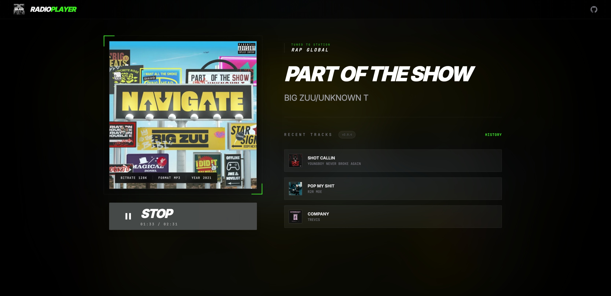

# RadioPlayer: Cyber-Retro Edition

A high-tech, immersive web-based radio player designed with a "Cyber-Retro" aesthetic. Built with modern web technologies and a focus on visual performance, it features dynamic theming, CRT effects, and a robust JavaScript API.



## Core Features

- **Cyber-Retro Aesthetic** - CRT scanlines, glassmorphism, and industrial UI elements.
- **Dynamic Theming** - Automatically extracts colors from album artwork to update the UI's accent colors and background.
- **Live Metadata** - Real-time track information including Bitrate, Format, Year, and high-quality artwork.
- **Visualizer** - Animated signal bars that respond during playback.
- **Lyrics & History** - Dedicated sliding panels for viewing song lyrics and playback history.
- **Developer API** - Fully customizable at runtime via a simple JavaScript interface.
- **Responsive** - Optimized layouts for mobile receivers and desktop terminals.

## Getting Started

1. **Clone the repository:**
   ```bash
   git clone https://github.com/joeyboli/radioplayer.git
   cd radioplayer
   ```

2. **Configure your stream:**
   Open `js/script.js` and update the `CONFIG` object at the top.
   - To generate a free API URL, sign up at [mad.radioapi.me](https://mad.radioapi.me/).
   - Generate your unique API URL from their dashboard.
   - Paste it into the `API_URL` field in the `CONFIG`.
   - Update `STREAM_URL` with your actual radio stream.

3. **Launch:**
   Open `index.html` in any modern browser. No build steps or dependencies required.

## Configuration

You can configure the player by editing the `CONFIG` object in `js/script.js`:

```javascript
let CONFIG = {
  STREAM_URL:   'https://your-stream.url/stream',
  API_URL:      'https://your-metadata-api.com/metadata',

  STATION_NAME: 'MY RADIO STATION',
  STATION_LOGO: 'https://link-to-your-logo.png',
  BRAND_NAME:   'Radio<span class="text-[var(--primary)]">Player</span>',

  PRIMARY_COLOR: '#f97316', // Initial theme color
  DYNAMIC_THEME: true,      // Set to false to use fixed colors

  META_INTERVAL_MS: 15_000, // Metadata refresh rate
};
```

## Public API

The player exposes a global `RadioPlayer` object for runtime customization. This is useful for building multi-station switchers or dynamic branding.

### `RadioPlayer.configure(options)`
Updates player settings on the fly.

```javascript
RadioPlayer.configure({
  STATION_NAME: 'New Station Name',
  PRIMARY_COLOR: '#38f916',
  DYNAMIC_THEME: false
});
```

**Supported Options:**
- `STATION_NAME` (String)
- `STATION_LOGO` (URL String)
- `BRAND_NAME` (HTML String)
- `PRIMARY_COLOR` / `ACCENT_COLOR` (Hex/RGB)
- `DYNAMIC_THEME` (Boolean)
- `STREAM_URL` / `API_URL` (Updates stream source)
- `DEFAULT_VOLUME` (0.0 - 1.0)

### `RadioPlayer.getState()`
Returns the current internal state of the player (track info, history, playback status).

### `RadioPlayer.getAudio()`
Returns the underlying HTML5 Audio object for direct control.

---

## Upgrade to RadioPlayer Pro 🚀

Looking for more features? Get **JCPlayer Pro** for advanced capabilities:
- **Multi-Station Support** - Manage multiple streams easily.
- **Advanced Visualizers** - Multiple styles and customization.
- **Premium Themes** - More built-in styles and layout options.
- **Dedicated Support** - Priority technical assistance.

[Get JCPlayer Pro Now](https://streamafrica.net/player/jcplayer)

---

## License

This project is licensed under the GNU Affero General Public License v3.0.
